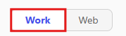
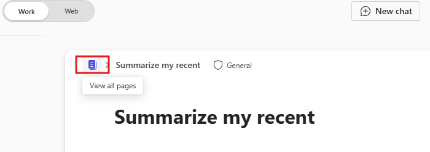

---
task:
  title: 沉浸式体验 - 业务经理
---

## 沉浸式体验 - 业务经理  

通过查看通信、发送电子邮件和准备即将召开的会议来优化日常任务。  

你将执行三个任务：  

- 使用 **Microsoft 365 Copilot Chat** 查看通信。  
- 使用 **Pages 中的 Copilot** 准备会议话题。
- 使用 **Outlook 中的 Copilot** 起草跟进电子邮件。  

> **备注：** 提供了示例提示以帮助你入门。 请根据需求随意进行个性化设置 - 发挥创意，尽情探索！ 如果 Copilot 未提供所需结果，请优化提示并重试。 享受这个过程，享受实验的乐趣！  

### 任务 1：查看通信  

使用 **Microsoft 365 Copilot Chat**，从最近与特定人员就特定主题或项目的交互中收集见解。 专注于确定关键点、拟办事项和任何未解决的问题。 这可确保你随时了解团队项目的最新情况，并让利益干系人了解进度、挑战和结果。  

**步骤：**

- 打开新的浏览器选项卡并导航到 [M365copilot.com](https://m365copilot.com/)。
- 确保 Copilot Chat 中已选择“工作模式”选项卡：

    

**示例提示**：

```text
Summarize my recent interactions with [/Name of Person] regarding [specific topic or project]. Organize the summary by key points or actions discussed, and include any follow-up items or outstanding questions that may require attention.
```

> **备注：** 将 [人员姓名] 替换为你关注的人员，将 [特定主题或项目] 替换为相关主题。 使用**/** 字符（斜杠）引用内部联系人，以便快速访问最近的交互。

### 任务 2：准备会议  

使用 **Pages 中的 Copilot**，根据 Microsoft 365 Copilot Chat 中收集的见解，为即将召开的利益干系人会议创建话题。 关注进度更新、关键日期、挑战或风险以及可操作的后续步骤，以确保讨论富有成效。

**步骤：**

1. 在上一个任务的“**Copilot Chat 回复**”下，选择“**在 Pages 中编辑**”：  
   

2. 在打开的新 Pages 屏幕中，选择“**查看所有 Pages**”：  
   

3. 在新 Pages 窗口中，选择文档右侧的“**Copilot 图标**”与 Copilot 进行交互。

**示例提示**：

```text
Using these insights, draft talking points for an upcoming stakeholder meeting. Focus on progress updates, key dates, challenges and next steps. 
```

> **提示：**  
> - Pages 可以用作与同事实时协作的协作空间。 键入“@”符号，然后键入同事的姓名以共享页面。
> - 添加同事后，单击其姓名以授予他们访问权限。 他们将收到一封电子邮件通知，其中包含在该页面上进行协作的链接。  

### 任务 3：发送跟进电子邮件  

使用 **Outlook 中的 Copilot**，根据 Microsoft 365 Copilot Chat 中收集的见解起草跟进电子邮件。 包括进度更新、挂起的操作、后续步骤以及请求召开跟进会议以进一步讨论等详细信息。

**步骤：**

- 在 **Outlook** 中，选择“**新建电子邮件**”，然后从功能区选择“**Copilot**” > “**使用 Copilot 起草**”

    

**示例提示**：

```text
Using the insights below, draft a follow-up email to [Name of Person] requesting an update on progress and next steps. Also, ask for a follow-up meeting to discuss further on the project deadline. 

[Paste insights from Copilot Chat here, or add your own insights]
```
