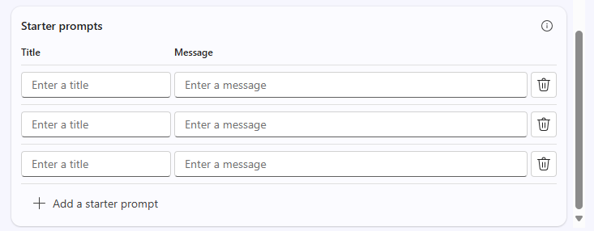

---
task:
  title: 沉浸式体验 - 智能体（高管）
---

## 沉浸式体验 - 智能体（高管）

了解 Microsoft 365 Copilot 和 Copilot Studio 如何通过设计简单的基于检索的智能体来帮助解决与工作相关的实际挑战****。 本练习将指导你如何识别问题、分解问题、探索 AI 在哪些方面可以提供帮助，然后创建一个概念性智能体来解决问题。  

你将执行四个任务：

- 确定与工作相关的问题  
- 分解问题并探索 AI 可以在哪些方面提供帮助  
- 使用研究助手发现见解和解决方案思路****  
- 在 Copilot Studio 中构思并模拟一个基于检索的智能体****  

> **注意：** 已提供示例提示帮助你快速上手，你可根据自身情况灵活调整，使其更贴合你的实际需求。 
>
> 如果你需要帮助生成或优化提示，可以尝试使用提示指导智能体<a href="https://appsource.microsoft.com/en-us/product/office/WA200007578" target="_blank"></a>，<br>该智能体能够提供提示建议、优化提示并评估提示质量，帮助你在使用 Copilot 时获得更优的结果。

### 任务 1：确定与工作相关的挑战  

首先，请思考你在自身角色中遇到的一个实际问题 - 某个会拖慢你工作速度或让信息难以获取的难题。 你可以独立思考，也可以将 Copilot 对话助手作为合作伙伴，帮助激发思路并识别通过知识检索和整理带来显著改变的挑战****。  

为引导你进行思考，请从以下角度进行考量：  

- “当前哪些方面进展顺利”****  
- “哪些方面不顺利”****  
- “AI 在哪些方面可能有帮助”******  

**步骤：**  

- 打开新的浏览器选项卡并导航到 [m365.cloud.microsoft/chat](https://m365.cloud.microsoft/chat)。  
- 确保 Copilot 对话助手中已选择“工作模式”选项卡********：  

     

    示例提示：****

   ```text
   I’m researching common day-to-day issues I face at work, such as processes, collaboration, or time management. Look at recent conversations from [Teams chats, Outlook emails, or other collaboration tools] related to [your role focus]. Summarize the key issues or pain points mentioned in the last 6 months. Show the results in a table with:  

    - Title: Short label for the issue  
    - Description: Brief summary of the challenge  
    - Frequency: How often it comes up (e.g., number of mentions)
   ```

### 任务 2：拆分问题

使用 Copilot 对话助手，应对任务 1 中确定的挑战，并将其分解为更小的子任务****：

- 这个问题难解决的原因是什么？  
- 信息会在哪些环节停滞或丢失？  
- 谁受到的影响最大？  

    示例提示（Copilot 对话助手 – 工作模式）：****

    ```text
    Break down the problem of [insert challenge]. Identify root causes, pain points, and which areas of work are most affected.
    ```

    > 提示****：思考一下，在哪些场景下，知识检索能够为你节省时间，或是帮助团队更快地做出决策。

### 任务 3：使用研究助手探索 AI 解决方案思路

使用研究助手智能体了解 Copilot 和智能体如何提供帮助****。 重点关注那些用于检索、整理或总结知识的解决方案，而非用于自动化任务的解决方案。 

**步骤：**

- 打开新的浏览器选项卡并导航到 [m365.cloud.microsoft/chat](https://m365.cloud.microsoft/chat)。
- 在“Copilot 对话助手”菜单中，展开“智能体”并选择“研究助手”********  

      

    示例提示（研究助手智能体）：****

    ```text
    Explore possible AI solutions to address [insert problem]. Focus on retrieval-based approaches using Microsoft Copilot, Copilot Studio agents, or connected knowledge sources. Summarize three possible solution approaches, their benefits, and limitations.
    ```

    > 提示****：寻找智能体可以使知识更易于查找、重复使用或共享的机会。

    > **注意：** 研究助手可能需要 5-10 分钟才能完成，具体取决于你的请求。 它的响应内容非常详细，因此，在它工作时，请尝试在 Copilot 对话助手中运行相同的提示。 对比两个输出，可以很好地了解每个工具对任务的处理。

### 任务 4：构思你的智能体

现在，请根据你获得的见解，在 Copilot Studio 中创建简易模拟智能体****。 请始终聚焦于检索功能 - 你的智能体应有助于发现、整理或汇总信息。

**步骤：**

- **在 Copilot Studio 中启动**

    1. 打开浏览器，导航到 [m365.cloud.microsoft/chat](https://m365.cloud.microsoft/chat)。
    1. 在右侧侧边栏中选择“创建智能体”选项，以启动 Copilot Studio********。

        

- **定义你的智能体（“描述”选项卡或“配置”选项卡）**

    1. 选择“描述”选项卡并使用此示例提示（或编写自己的提示）****：

        ```text
        You’re a virtual assistant for our [project/team name]. Your role is to help with [key tasks]. Be concise, stay on-brand, and reference our shared resources when possible.
        ```

        

        > **注意：** 可以从头开始或基于模板的智能体，该模板预填充了稍后可以自定义的设置和说明。

    1. 如果“描述”不可用，请切换到“配置”选项卡并手动输入相同的详细信息：名称、描述和智能体说明********。

        

- **自定义智能体**

    在“配置”选项卡中，浏览以下选项****：

    1. 至少添加一个知识源（例如，保存到 OneDrive/SharePoint 或电子邮件的文档）。

        

    1. 定义初学者提示以帮助其他人开始使用你的智能体

        

        > 提示****：初学者提示可帮助指导用户如何与你的智能体交互。

- **测试和创建**

    1. 使用“测试”功能（在整个智能体构建过程中，可在右侧面板中找到该功能）来试用你的草稿智能体，并优化存在的任何问题****。
    2. 感到满意后，选择“创建”以发布该智能体****。
    3. 与他人共享你的智能体或将其打开以供立即使用。  

> 提示****：今日的目标并非构建一个完美的智能体，而是探索以检索为核心的智能体如何在你的日常工作中让知识获取变得更便捷。
