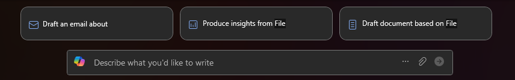

---
task:
  title: 沉浸式体验 - 运营
---

## 沉浸式体验 - 运营

评估潜在供应商并概述过渡过程，起草供应商过渡计划。

你将执行三个任务：  

- 使用 **Microsoft 365 Copilot Chat** 研究供应商选项。  
- 使用 **Word 中的 Copilot** 制定供应商过渡计划。  
- 使用 **Outlook 中的 Copilot** 传达供应商更改。  

> **备注：** 提供了示例提示以帮助你入门。 请根据需求随意进行个性化设置 - 发挥创意，尽情探索！ 如果 Copilot 未提供所需结果，请优化提示并重试。 享受这个过程，享受实验的乐趣！  

### 任务 1：研究供应商选项  

使用 **Microsoft 365 Copilot Chat**，研究并比较特定产品或服务的潜在供应商。 确定关键决策因素，例如成本、可靠性、服务级别协议 (SLA) 和可伸缩性。  

**步骤：**

- 打开新的浏览器选项卡并导航到 [M365copilot.com](https://m365copilot.com/)。
- 确保在 Copilot Chat 中选择“Web 模式”选项卡：

    

**示例提示**：

```text
Compare three leading suppliers for [product/service] in [select your industry]. Provide a summary of pricing, contract flexibility, service reliability, and customer support quality.
```

> **备注：** 将 [产品/服务] 替换为正在评估的供应商过渡项目或服务。 将 [选择行业] 替换为相关行业，例如医疗保健、制造或零售。  

> **提示**  
>
> - 要求 Copilot 将回复导出到 Word 文档进行保存，以供后续任务使用。 将文档保存到 OneDrive 并复制共享 URL。
> - 要复制链接，请打开保存的 Word 文档并选择“**共享**” > “**复制链接**”，如下所示：  
> 

### 任务 2：制定供应商过渡计划  

使用 **Word 中的 Copilot** 起草结构化计划，概述供应商过渡过程、预期收益和关键风险。 确保计划中包括更换理由、过渡时间线和利益干系人注意事项。  

- 从浏览器 ([word.new](https://word.new)) 启动 Microsoft Word 或使用桌面应用程序。
- 输入提示，其中显示 **“描述要写入的内容”**。

    

**示例提示**：

```text
Based on the supplier research from [Paste in shared Word document link from Task 1], draft a Supplier Transition Plan outlining why [Company] is switching to [Supplier X]. Include key benefits, a transition timeline, and potential risks.
```

> **备注：** 将 [公司] 替换为你的组织，将 [供应商 X] 替换为所选供应商。 根据业务需求调整细节。

> **提示**要求 Word 中的 Copilot 将转换计划汇总为 3-4 个关键点，以便在电子邮件更新中使用。

### 任务 3：传达供应商更改  

使用 **Outlook 中的 Copilot** 起草电子邮件，向团队宣布拟议的供应商过渡计划。 明确解释过渡的理由、预期收益以及确保平稳过渡所需的任何行动步骤。  

**步骤：**

- 在 **Outlook** 中，选择“**新建电子邮件**”，然后从功能区选择“**Copilot**” > “**使用 Copilot 起草**”

    

**示例提示**：

```text
Write an internal email to my team announcing a potential supplier transition to [Supplier X] using the key points below:

[Summarized key points from the Supplier Transition Plan]
```

> **备注：** 将 [供应商 X] 替换为所选供应商，并为内部受众定制消息。
